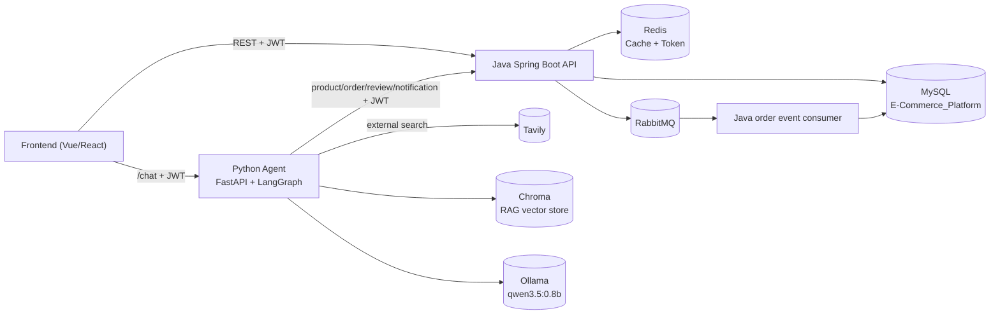
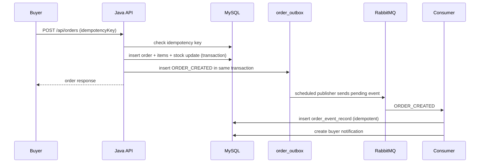
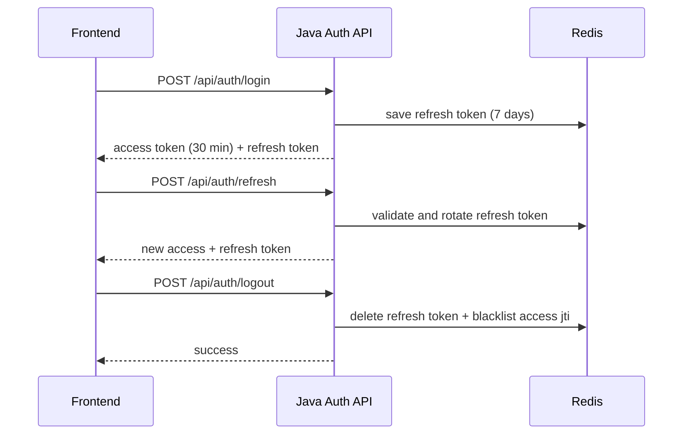
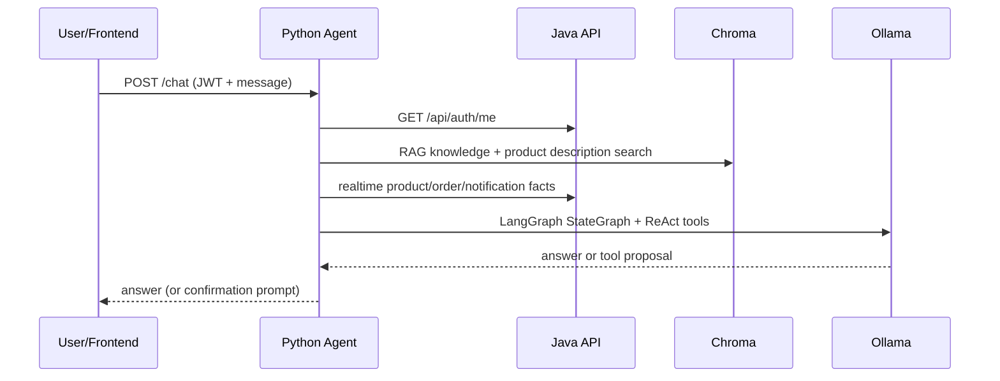

# E-Commerce-Platform

基于 Spring Boot 3 的电商后端项目，覆盖用户体系、商品、购物车、订单、支付模拟、AI 对话等完整业务闭环，并针对实习/校招项目场景做了安全、分层、测试、缓存和 CI 方面的工程化改进。

## 技术栈

- Java 17 + Spring Boot 3.3.6
- Spring Security + JWT（jjwt 0.12.6）+ BCrypt 密码加密
- MyBatis-Plus 3.5.15 + MySQL 8
- Spring Data Redis + Spring Cache（商品/分类缓存）
- RabbitMQ + 本地消息表（outbox）+ 幂等消费
- Flyway 数据库版本管理
- Knife4j / OpenAPI 3 API 文档
- 阿里云 DashScope（通义千问）AI 接口
- 可选 Tavily 外部联网检索
- 按角色过滤的后端 API 能力目录
- JUnit 5 + Mockito + H2 + MockMvc 测试
- Maven + GitHub Actions CI

## 三角色用户模型

系统支持三种登录身份，每种身份使用独立数据表存储：

| 角色 | 表 | 说明 |
| --- | --- | --- |
| 管理员 ADMIN | `user_admin` | 管理买家/卖家、商品分类 |
| 买家 BUYER | `user_buyer` | 购物车、下单、支付、订单管理 |
| 卖家 SELLER | `user_seller` | 管理自己的商品（`product.seller_id` 归属） |

登录接口必须同时指定角色、用户名和密码，JWT 中携带 `role` 声明，接口通过 `@PreAuthorize` 校验权限。

## 架构与时序

### 系统架构



### 下单与 Outbox 时序



### JWT 刷新与退出时序



### Agent 对话时序



## 内置账号（密码均为 BCrypt 存储）

| 用户名 | 密码 | 角色 |
| --- | --- | --- |
| `admin` | `admin` | ADMIN |
| `buyer01` / `buyer02` | `123456` | BUYER |
| `seller01` / `seller02` | `123456` | SELLER |

## 数据库

`sql/schema.sql` 和 `sql/seed.sql` 提供完整建表与种子数据，目标库为 `E-Commerce_Platform`，包含：

`sql/demo_bulk_data.sql` 可批量生成 10 个商家（每个 10 个商品）、50 个买家的演示数据，商品在 5 个分类间平均分配。

- `user_admin` / `user_buyer` / `user_seller`
- `product_category` / `product`
- `cart`
- `order_info` / `order_item`（订单快照明细）

核心业务约定：

- 下单时从购物车生成订单，写 `order_info` + `order_item` 商品快照，扣减库存，清空购物车，整体事务包裹
- 下单幂等键 + 唯一索引，订单超时自动关单并恢复库存
- 订单发货后 24 小时自动确认到货；发货后至完成前可申请退款，卖家同意后恢复库存并完成模拟退款
- 订单事件（ORDER_CREATED/ORDER_PAID）走 outbox + RabbitMQ，消费侧唯一索引幂等
- 扣库存使用 SQL 级条件更新 `UPDATE product SET stock = stock - ? WHERE id = ? AND stock >= ?`，避免并发超卖
- 用户表、角色表启用 MyBatis-Plus 逻辑删除（`deleted` 字段）

新订单会按卖家自动拆分为多张独立订单。一次结算生成同一个 `checkout_group_id`，
每张卖家订单拥有独立的订单号、金额、状态、支付、发货、退款和确认收货流程。
历史数据不迁移，旧订单仍按原订单结构查询。

## 主要接口

| 模块 | 路径 | 权限 |
| --- | --- | --- |
| 认证 | `POST /api/auth/login`、`POST /api/auth/register` | 公开 |
| 令牌 | `POST /api/auth/refresh`、`POST /api/auth/logout` | 公开 |
| 当前用户 | `GET /api/auth/me` | 已登录 |
| 商品 | `GET /api/products`、`GET /api/products/{id}` | 公开，关键词支持商品名或唯一店铺名 |
| 商品管理 | `POST/PUT/DELETE /api/products/**` | SELLER（仅本人商品） |
| 分类 | `GET /api/categories/**` | 公开 |
| 分类管理 | `POST/PUT/DELETE /api/categories/**` | ADMIN |
| 购物车 | `/api/carts/**` | BUYER |
| 订单 | `/api/orders/**` | BUYER |
| 用户管理 | `/api/admin/users/**` | ADMIN |
| AI | `/api/ai/**` | 公开 |
| 上传 | `POST /api/upload/image` | 已登录 |
| 评价 | `POST /api/reviews`、`DELETE /api/reviews/{id}` | BUYER |
| 评价查询 | `GET /api/products/{id}/reviews`、`/summary` | 公开 |
| 个人资料 | `GET/PUT /api/profile`、`PUT /api/profile/password` | BUYER / SELLER |
| 评价回复 | `GET /api/seller/reviews`、`PUT /api/seller/reviews/{id}/reply` | SELLER |
| 管理员订单 | `GET /api/admin/orders`、`PUT /api/admin/orders/{id}/force-cancel` | ADMIN |
| 卖家统计 | `GET /api/seller/stats?range=today/7d/30d/all` | SELLER |
| 退货退款 | `/api/returns/**` | BUYER |
| 卖家退货处理 | `/api/seller/returns/**` | SELLER |

AI Agent（`ai-agent/`）：FastAPI + LangChain/LangGraph + Ollama，提供进程内短期会话记忆（每个用户一条会话，保留最近 20 条消息），回答前会先检索知识库、商品描述、实时库存价格和真实评价。

Agent 将内部知识、外部搜索和业务操作分层处理：

- Chroma 保存 FAQ、政策和商品描述。
- Tavily 用于外部实时信息，未配置 API Key 时自动禁用。
- `data/api_catalog.json` 保存后端接口能力和权限信息。
- 订单、购物车、退款和管理操作继续通过带 JWT 的 Java 工具执行。
- MySQL 地址、端口、用户名、密码和 JDBC URL 不进入 Agent 知识库或提示词。

登录后返回 30 分钟 access token 和 7 天 refresh token；refresh token 每次刷新后轮换，退出登录会把 access token 写入 Redis 黑名单并删除 refresh token。

状态码统一由枚举维护并与数据库注释保持一致：`OrderStatusEnum`、`ProductStatusEnum`、`CategoryStatusEnum`、`ReturnStatusEnum`。

API 文档（本地启动后）：`http://localhost:8080/doc.html`

详细架构、订单拆单、Agent 路由和数据库索引设计见
[`docs/architecture.md`](docs/architecture.md)。

## 运行环境

敏感配置通过环境变量注入，参考根目录 `.env.example`。启动前先在本地设置以下环境变量：

| 环境变量 | 说明 | 示例 |
| --- | --- | --- |
| `MYSQL_HOST` | MySQL 地址 | `localhost` 或 `192.168.x.x` |
| `MYSQL_PORT` | MySQL 端口 | `3306` |
| `MYSQL_USERNAME` | MySQL 用户 | `root` |
| `MYSQL_PASSWORD` | MySQL 密码 | 你的密码 |
| `REDIS_HOST` | Redis 地址 | `localhost` 或 `192.168.x.x` |
| `REDIS_PORT` | Redis 端口 | `6379` |
| `REDIS_USERNAME` | Redis ACL 用户 | `default` 或你的用户 |
| `REDIS_PASSWORD` | Redis 密码 | 你的密码 |
| `JWT_SECRET` | JWT 签名密钥，至少 32 位随机串 | 长随机字符串 |
| `ALIYUN_AI_API_KEY` | 阿里云 DashScope API Key | 你的 Key |
| `UPLOAD_DIR` | 图片上传目录 | `./uploads` |

IDEA 中在 Run Configuration 的 `Environment variables` 里配置；命令行可先执行：

```bash
export MYSQL_HOST=localhost
export MYSQL_USERNAME=root
export MYSQL_PASSWORD=your-password
export JWT_SECRET=your-long-random-secret
```

启动前需要：

1. 在 VM MySQL 执行 `sql/schema.sql` 和 `sql/seed.sql`
2. 确认 Redis 可访问并已配置 ACL 用户
3. 设置上述环境变量后执行 `mvn spring-boot:run`（或直接运行 `Project01Application`）

## 测试

测试使用 H2（MySQL 兼容模式）+ MockMvc，不依赖外部 MySQL/Redis，可离线运行：

```bash
mvn test
```

当前完整测试为 `51` 个，覆盖 JWT 生成解析、三角色登录、注册恢复、购物车下单、
多卖家拆单、批量订单详情、库存扣减、并发库存竞争、重复发货、权限拒绝、
订单生命周期、评价、退款和管理员接口。可靠性测试额外覆盖库存不足时整单事务
回滚、重复支付只产生一次支付事件，以及 RabbitMQ 重复消费不重复创建通知。

`RealMiddlewareIntegrationTest` 使用 Testcontainers 启动真实 MySQL 8.4、Redis 7.4 和
RabbitMQ 3.13，验证 Redis 缓存、MySQL 下单事务、Outbox 发布、消息消费和通知副作用。
本机需要运行 Docker；没有 Docker 时该组测试会自动跳过。当前完整测试结果：

```text
Tests run: 51
Failures: 0
Errors: 0
Skipped: 0
BUILD SUCCESS
```

## 可观测性

Actuator 与 Micrometer 提供以下本地端点：

- `GET /actuator/health`
- `GET /actuator/info`
- `GET /actuator/metrics`
- `GET /actuator/prometheus`

每个 HTTP 请求都会生成或复用 `X-Trace-Id` 响应头，并在日志的
`logging.pattern.correlation` 中输出对应 `traceId`，便于串联请求日志。

除 JVM、HTTP 和数据库指标外，项目还提供以下业务指标：

- 订单创建成功与拒绝数量
- 支付、取消、发货、收货等状态迁移结果
- 库存扣减和恢复结果
- 商品缓存命中、未命中和空值缓存命中
- Outbox 发布结果、待发送数量和最老消息等待时间
- MQ 新事件、重复事件和消费失败数量

`traceId` 会写入 Outbox，并继续传递给 RabbitMQ 消费端，因此下单请求、支付请求、
异步通知和消费日志可以使用同一个链路标识定位。

## CI

`.github/workflows/maven.yml` 在 push / PR 时自动执行：

- Java 17 完整后端测试
- Python Agent 单元测试
- Vue 前端生产构建

## 前端

前端位于 `frontend/`，使用 Vue 3、Vite、Element Plus、Pinia 和 Vue Router。

本地开发：

```bash
cd frontend
pnpm install
pnpm run dev
```

默认地址为 `http://localhost:5173`，Vite 会把 `/api`、`/uploads` 转发到 Java 服务，
把 `/agent` 转发到 Python Agent。

管理端已覆盖：

- 平台数据概览
- 全部订单查询、详情和强制关单
- 买家账号查询和删除
- 卖家账号、店铺资料查询和删除
- 分类新增、编辑、启停和删除
- 管理员资料与密码修改

生产构建：

```bash
cd frontend
pnpm run build
```

## Docker Compose

`docker-compose.yml` 提供 MySQL、Redis、RabbitMQ、Ollama、Java 后端、Agent 和前端的本地一键启动：

```bash
docker compose up -d --build
```

首次启动会自动执行 `sql/schema.sql`、`sql/seed.sql` 和 `sql/demo_bulk_data.sql`。
Compose 中的 Java 容器关闭 Flyway，避免初始化 SQL 与迁移脚本重复建表。
Agent 从本机未提交的 `ai-agent/.env` 读取 `TAVILY_API_KEY`，但容器内会使用
`http://java:8080` 访问后端，并通过 `http://ollama:11434` 访问 Compose 内部的
Ollama 服务。

启动前需要确认：

1. Docker Desktop 正在运行
2. 已从 `ai-agent/.env.example` 创建 `ai-agent/.env`
3. Docker 数据盘预留模型空间，首次启动需要下载 Ollama 模型

启动后访问：

- 前端：`http://localhost:5173`
- Java API：`http://localhost:8080`
- Agent：`http://localhost:8000`
- Agent 健康检查：`http://localhost:8000/health`
- RabbitMQ 管理页：`http://localhost:15672`

`ollama-init` 会自动下载 `OLLAMA_MODEL` 和 `EMBEDDING_MODEL`。模型保存在
`ollama-data` 卷中，后续启动不会重复下载。宿主机不再需要单独启动 Ollama。
Docker 默认使用 CPU 推理，首次下载和首次加载模型会明显慢于后续请求；可通过
`docker compose logs -f ollama-init` 查看模型下载进度。

Nginx 已为 `/agent/chat/stream` 关闭响应缓冲和缓存，确保 Agent 流式输出能够实时
到达浏览器。若需要清空本地数据库和向量数据重新初始化：

```bash
docker compose down -v
docker compose up -d --build
```

`down -v` 也会删除已经下载的 Ollama 模型，再次启动时会重新下载。
