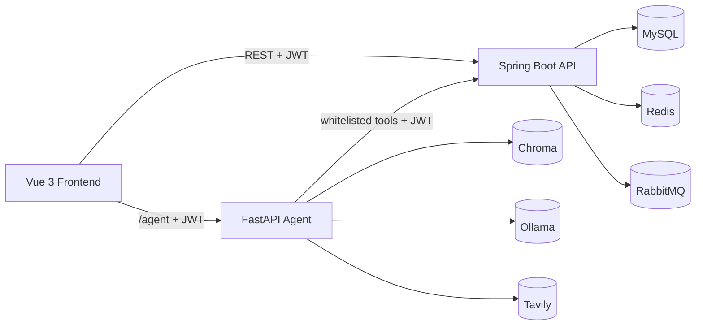
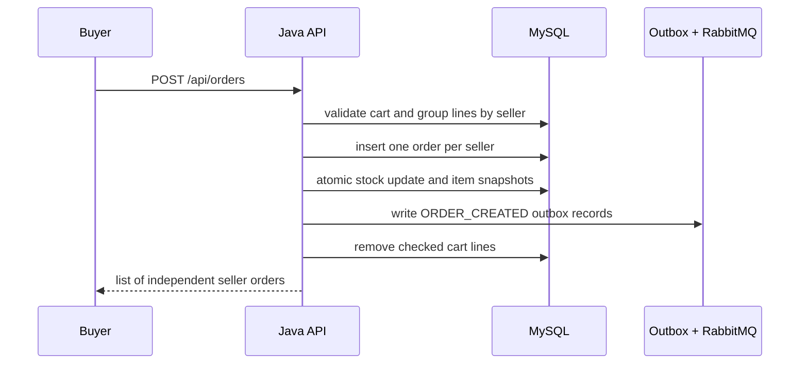
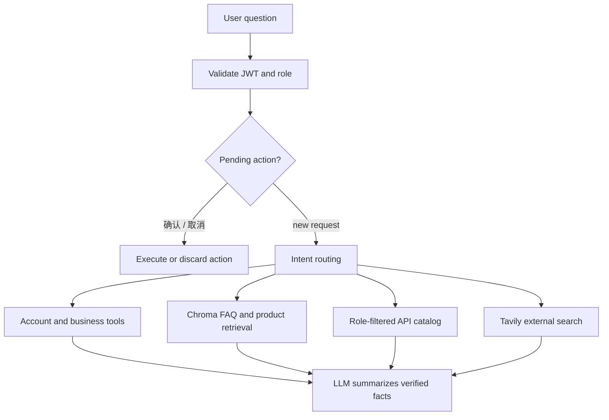

# E-Commerce Platform Architecture

## 1. System Overview



Java backend owns authentication, authorization, transactions, stock and
database access. The Agent never connects to MySQL directly.

## 2. Role and Authentication Model

- `ADMIN`, `BUYER`, and `SELLER` use separate account tables.
- Login requires role, username and password.
- Access tokens are short-lived and refresh tokens are stored and rotated in Redis.
- Logout deletes the refresh token and blacklists the access-token JTI.
- Service methods and controllers enforce ownership and role boundaries.

## 3. Order Model

New checkouts are split into one independent order per seller. All split orders
created by one checkout share a `checkout_group_id`.



Order states:

```text
0 待付款
1 待发货
2 待收货
3 已完成
4 已取消
```

Each seller order independently supports payment, shipping, refund and receipt
confirmation. Historical orders created before splitting remain readable through
the legacy product-ownership fallback.

Buyer and seller order pages also expose a batch detail endpoint
(`/page-details`). It loads the page of orders, items, products, sellers and
reviews with indexed batch queries, avoiding one detail request per order.

## 4. Cache and Stock Safety

- Product detail uses Redis read-through cache and negative caching.
- A Guava Bloom filter rejects impossible product IDs before database access.
- Cache rebuilding uses a short Redis single-flight lock.
- Stock deduction uses:

```sql
UPDATE product
SET stock = stock - ?
WHERE id = ?
  AND stock >= ?
```

The conditional update is the final concurrency guard. An early stock check may
return a clear business error, but correctness does not depend on that check.

## 5. Outbox and Idempotent Consumption

- `order_info`, `order_item` and the outbox record are written in one transaction.
- A scheduled publisher sends pending outbox events to RabbitMQ.
- `order_event_record` has a unique key on `(order_id, event_type)`.
- Notification creation is idempotent, so redelivery does not duplicate events.

## 6. Agent Routing



Knowledge and execution are separated:

- Account, order, cart, refund and product facts come from Java tools.
- FAQ, policy and product descriptions come from Chroma.
- `data/api_catalog.json` describes available backend capabilities and roles.
- Tavily is used only for external or real-time information.
- External search results are untrusted reference material.
- Database host, port, username, password and JDBC URL are never exposed to the model.

Write actions use two-phase confirmation. The model proposes an action, the user
replies `确认`, and only then does Agent call the Java write endpoint.

## 7. Reliability and Observability

Reliability protections are verified at both unit and infrastructure level:

- A checkout that fails after an earlier seller order was created rolls back
  order rows, stock deductions, cart removal and outbox records together.
- Repeating a payment transition throws a business error and creates only one
  `ORDER_PAID` event.
- RabbitMQ redelivery is idempotent. The inbox record and notification writes
  run in one transaction, so a failure cannot leave a consumed record without
  the corresponding notification.

Micrometer exports low-cardinality business metrics through
`/actuator/prometheus`:

- checkout success and rejected requests
- order transition outcomes by action
- stock decrease and increase outcomes
- product cache hit, miss and negative-cache hit results
- outbox publish outcomes, pending count and oldest pending age
- MQ new, duplicate and failed event outcomes

`X-Trace-Id` is stored on outbox messages and copied to inbox records. The
RabbitMQ listener restores it into MDC before processing, so HTTP and async
worker logs share one correlation id. Database credentials are never included
in trace data or Agent context.

## 8. Database Index Design

### `order_info.seller_id`

Used by seller order queries after seller-based order splitting:

```sql
SELECT *
FROM order_info
WHERE seller_id = ?
```

Without this index, a seller order query would scan the whole order table. The
field is nullable for legacy orders, while new split orders always set it.

### `order_info.status + create_time`

Used by status pages and scheduled order maintenance:

```sql
SELECT *
FROM order_info
WHERE status = ?
ORDER BY create_time DESC;
```

It also supports unpaid-order timeout scans and shipped-order auto-completion
scans. `status` is an equality predicate and `create_time` is the range/sort
field, so this order matches the access pattern.

### `order_item.order_id`

Used when loading items for an order:

```sql
SELECT *
FROM order_item
WHERE order_id = ?;
```

Order detail, shipping, refund, review and stock restoration all need this
lookup. It is the main index on the order-detail read path.

### `order_item.product_id`

Used for historical seller ownership checks, product sales aggregation and
statistics:

```sql
SELECT *
FROM order_item
WHERE product_id IN (...);
```

New split orders can use `seller_id` directly, but this index remains necessary
for compatibility and product-level statistics.

### `product_review.product_id`

Used by review pages and rating aggregation:

```sql
SELECT AVG(rating), COUNT(*)
FROM product_review
WHERE product_id = ?;
```

It prevents product detail and recommendation queries from scanning the full
review table.

### `user_seller.shop_name` functional index

The search code performs case-insensitive exact and prefix matching:

```sql
LOWER(shop_name) = LOWER(?)
LOWER(shop_name) LIKE CONCAT(LOWER(?), '%')
```

A functional index on `LOWER(shop_name)` supports these expressions. It does not
accelerate arbitrary `%keyword%` searches, which is why the service tries exact
and unique-prefix shop resolution before falling back to product search.

Indexes speed reads but add write and storage cost. The project keeps only
indexes tied to real query paths instead of indexing every column.

## 9. Testing Strategy

- H2 + MockMvc tests cover normal business flows and permissions.
- Testcontainers starts real MySQL, Redis and RabbitMQ for infrastructure tests.
- Order tests cover idempotency, stock restoration, split orders, seller shipping
  and buyer receipt confirmation.
- Concurrency tests cover the last-stock race and duplicate shipping attempts.
- Reliability tests cover checkout rollback, duplicate payment and duplicate
  RabbitMQ delivery.
- Observability tests assert Prometheus business metrics and trace propagation.
- Agent tests cover intent routing, permissions, confirmation, RAG and Tavily
  response handling.
